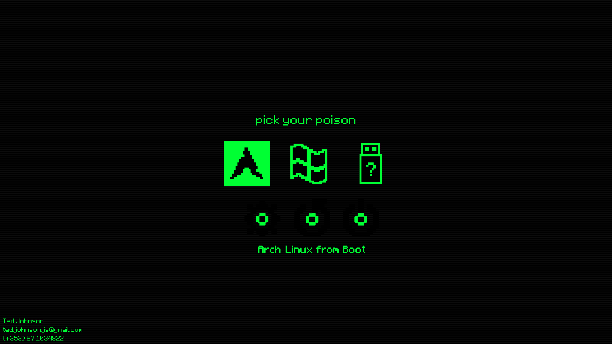

My personal [rEFInd](https://www.rodsbooks.com/refind/)  resource files.

### Installation

[Install rEFInd](https://www.rodsbooks.com/refind/installing.html) as you would normally.

Create  `themes` folder in /refined/ paste the contents there.

in /refined edit `refind.conf` and add this as the last line include  `include themes/custom/theme.conf `

You can add icons if you want custom ones (icon folders, .png 1280x1280)

You'll also want to edit the [background image](./background.png).
